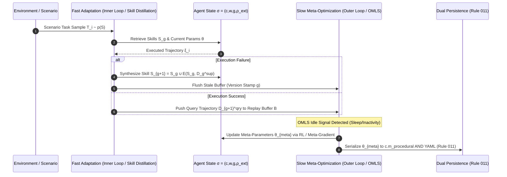

# Wave 4 Front 07 — Meta-Learning Layer: Ratified Master Specification

**Front**: Front 07 — Meta-Learning  
**Wave**: Wave 4 (Meta-Learning & Architectural Evolution)  
**Target Substrate**: HYPOSTASES Engine ($\sigma = (c, w, g, \rho_{\text{ext}})$)  
**Status**: RATIFIED MASTER SPECIFICATION  
**Rule 005 Invariant**: Pure Game-Theoretic & Probabilistic Rationality (Zero Artificial Human Cognitive Biases)  
**Rule 011 Compliance**: Dual Persistence for Meta-Parameters ($\theta_{\text{meta}}$)

---

## 1. Executive Summary & Core Objective

The Meta-Learning Layer enables agents in the HYPOSTASES engine to adapt not only their persistent state $\sigma = (c, w, g, \rho_{\text{ext}})$, but also their internal reasoning, active sensing, planning, and memory update mechanisms. The learning process itself becomes an explicit optimization target.

Meta-learning operators modify functional mappings over $\sigma$ without introducing non-computable state mutations; all meta-parameters $\theta_{\text{meta}}$ are strictly typed, computable mathematical projections ($\text{proj}_{\text{meta}}(c)$).

---

## 2. Adaptation Targets in $\sigma = (c, w, g, \rho_{\text{ext}})$

The Meta-Learning Layer systematically optimizes six adaptation targets:
1. **Policy Allocation ($\pi$)**: Active sensing and planning action distribution parameters.
2. **Planner Structure**: Horizon depth $h$, particle counts, Monte Carlo rollout parameters, and basis dimension $K$ (Rule 008).
3. **Utility Update Rules**: Dynamic utility weights ($g.u$), pragmatic-epistemic mixing coefficients $\beta$, and EFE active sensing parameters (Rule 009).
4. **Learning Rates & Decay Coefficients**: Adaptive per-layer learning rates $\alpha_{i,j}$ and weight decay / EMA coefficients $\beta_{i,j}$ (e.g. `MOOD_DECAY_RATE` = 0.1, Rule 004).
5. **Inference Parameters**: Effective Sample Size (ESS) thresholds, particle filtering variance, and message-passing tolerances.
6. **Procedural Skill Artifacts**: Fast natural-language skill directives ($\mathcal{S}$) in $c.m_{\text{procedural}}$ synthesized from execution failure trajectories (MetaClaw paradigm).

---

## 3. Formal Mathematical Architecture & State Dynamics

### 3.1 Dual-Timescale Bi-Level Meta-Optimization

Meta-learning in HYPOSTASES is governed by a dual-timescale bi-level optimization framework uniting MAML (Finn et al. 2017), Hierarchical Bayes (Grant et al. 2018), ALFA (Baik et al. 2020), MetaPEFT (Tian et al. 2025), and MetaClaw (Xia et al. 2026).



#### Inner-Loop Fast Adaptation (Step-Wise & Skill-Driven)
For a sampled scenario $\mathcal{S}_i \sim p(\mathcal{S})$, fast adaptation operates across two complementary modalities:
1. **Parametric Weight Adaptation (ALFA & MetaPEFT)**:
   $$\theta_{i, j+1} = \text{Softplus}(\gamma_{i,j}) \odot \beta_{i,j} \odot \theta_{i,j} - \alpha_{i,j} \odot \nabla_\theta \mathcal{L}_{\mathcal{S}_i}^{\mathcal{D}_i}(f_{\theta_{i,j}})$$
   where $(\alpha_{i,j}, \beta_{i,j}) = g_\phi(\bar{\tau}_{i,j})$ is generated by the meta-network $g_\phi$ conditioned on state summary $\bar{\tau}_{i,j} = [\nabla_\theta \mathcal{L}, \theta]$, and $\gamma_{i,j} \in \mathbb{R}$ is the continuous differentiable modulator.

2. **Declarative Skill Adaptation (MetaClaw)**:
   $$\mathcal{S}_{g+1} = \mathcal{S}_g \cup \mathcal{E}\left(\mathcal{S}_g, \mathcal{D}_g^{\text{sup}}\right)$$
   where failure trajectories $\mathcal{D}_g^{\text{sup}}$ are distilled by skill evolver $\mathcal{E}$ into prompt instructions in $c.m_{\text{procedural}}$.

#### Outer-Loop Meta-Optimization (Empirical Bayes & OMLS)
Outer-loop meta-updates occur during user-inactive windows via the Opportunistic Meta-Learning Scheduler (OMLS):

$$\theta_{\text{meta}} \leftarrow \theta_{\text{meta}} - \eta_{\text{meta}} \nabla_{\theta_{\text{meta}}} \sum_{\mathcal{S}_i \sim p(\mathcal{S})} \left[ \mathcal{L}_{\mathcal{S}_i}^{\mathcal{D}_i'}\left(f_{\theta'_i}\right) + \frac{1}{2} \log \det(\hat{\mathbf{H}}_i) \right]$$

where $\hat{\mathbf{H}}_i$ is the K-FAC Laplace curvature matrix penalizing model complexity (Grant et al. 2018).

---

### 3.2 Expected Free Energy (EFE) Unification & Preference Compatibility

Under Rule 009 (`efe_mode: true`), active sensing action selection minimizes Expected Free Energy $G(a)$. Following Champion et al. (2024), the active sensing engine evaluates policy $a$ using the unified Observation-Risk formulation ($\mathcal{C}_{\text{ROA}}$):

$$G(a) = D_{KL}[F(\bar{o} \mid a) \parallel T(\bar{o} \mid a)] + \mathbb{E}_{F(\bar{s} \mid a)}[H[F(\bar{o} \mid \bar{s})]]$$

#### Mathematical Equivalence & Bounds
- **Information Gain + Pragmatic Value ($\mathcal{C}_{\text{IGPV}}$)**:
  $$G(a) = -\mathbb{E}_{F(\bar{o} \mid a)}[D_{KL}[F(\bar{s} \mid \bar{o}, a) \parallel F(\bar{s} \mid a)]] - \mathbb{E}_{F(\bar{o} \mid a)}[\ln T(\bar{o} \mid a)] \equiv \mathcal{C}_{\text{ROA}}(a)$$
- **State-Risk Upper Bound ($\mathcal{C}_{\text{RSA}}$)**:
  $$G(a) \le D_{KL}[F(\bar{s} \mid a) \parallel T(\bar{s} \mid a)] + \mathbb{E}_{F(\bar{s} \mid a)}[H[F(\bar{o} \mid \bar{s})]] = \mathcal{C}_{\text{RSA}}(a)$$
- **Preference Compatibility Invariant**:
  Prior preferences over observations $C_o$ MUST satisfy the linear mapping over state preferences $C_s$ via likelihood tensor matrix $A$:
  $$C_o = A C_s$$
  Arbitrary specification of $C_o$ outside the image of $A$ on the 1-simplex is strictly forbidden.

---

### 3.3 Multi-Frequency Nested Optimization Hierarchy

Following Behrouz et al. (2025), memory components in $c$ are structured into a Continuum Memory System (CMS) with ordered update frequencies $f_{\text{tier}-1} \succ f_{\text{tier}-2} \succ f_{\text{tier}-3}$:

```
Tier 1 (High Frequency: f_1): State Transitions (Fast Adaptation Ticks)
   └── Inner loop fast updates (ALFA learning rates α_{i,j}, single-step trajectory transitions)
Tier 2 (Medium Frequency: f_2): World Models & Peer Beliefs (Scenario Ticks)
   └── Sub-network updates (w.peer_beliefs, trust profile T_j = (T_honesty, T_competence))
Tier 3 (Low Frequency: f_3): Meta-Parameters θ_meta & Skill Evolution (OMLS Ticks)
   └── Outer loop meta-gradient updates & MetaClaw skill library consolidation S_g
```

---

## 4. Compliance with Standing Rules

### 4.1 Rule 005 Invariant — Zero Artificial Human Cognitive Deficiencies
- All utility updating ($g.u$), peer trust scoring ($w.\text{peer\_beliefs}$), and meta-parameter updates are derived purely from probabilistic inference, game-theoretic payoff matrices, and variational free energy minimization.
- Artificial irrationalities (sunk-cost penalties, cognitive dissonance costs, emotional decay functions) are strictly prohibited.

### 4.2 Rule 011 Invariant — Dual Persistence & Performance Monitoring for $\theta_{\text{meta}}$
- **Dual Persistence Architecture**:
  1. **In-Memory Projection**: Meta-parameters $\theta_{\text{meta}}$ reside as typed tensor tuples within in-memory projection $c.m_{\text{procedural}}$.
  2. **YAML Serialization**: Persistent state snapshots MUST be serialized into human-readable YAML files (`schema/meta_parameters_preset.yaml`).
- **Prohibition**: PURGING OR DEPRECATING YAML SERIALIZATION IS STRICTLY FORBIDDEN.
- **Performance Monitoring**: High-frequency tick serialization MUST be benchmarked. If YAML serialization creates a computational bottleneck during high-frequency simulation, prompt the User per Rule 007 regarding compressed binary formats (e.g. MessagePack or Protocol Buffers).

### 4.3 Rule 008 Invariant — Kinematic Motion Primitive (kMP) Basis Dimension $K$
- Default Gaussian basis dimension for continuous `SkillArtifact` procedural memory is set to $K = 4$.
- Test suite evaluates performance and benchmarks $K = 8$ as an alternative configuration under expressiveness trade-offs.

---

## 5. Declarative YAML Schemas

### 5.1 `schema/meta_learning_config.yaml`
```yaml
# HYPOSTASES Meta-Learning Layer Configuration Schema
# Rule 006 & Rule 009 Compliant

meta_learning_layer:
  version: "4.0.0"
  enabled: true

  # Rule 009: Default Active Sensing EFE Configuration
  active_sensing:
    efe_mode: true
    fallback_utility_mixing:
      beta_epistemic: 0.5
      pragmatic_weight: 0.5
    preference_compatibility:
      enforce_simplex_projection: true # Enforces C_o = A * C_s

  # ALFA Adaptive Hyperparameters (Baik et al. 2020)
  alfa_configuration:
    enabled: true
    base_learning_rate: 0.01
    default_mood_decay_rate: 0.1 # Rule 004 Calibration Target
    generator_network:
      layers: 3
      hidden_dim_multiplier: 2
      activation: "relu"
    post_multipliers:
      enable_layerwise_scaling: true

  # MetaPEFT Differentiable Modulators (Tian et al. 2025)
  meta_peft:
    enabled: true
    modulator_activation: "softplus"
    initial_gamma: 1.0
    outer_loop_sampling_ratio: 0.20

  # MetaClaw Dual-Timescale Agent Evolution (Xia et al. 2026)
  meta_claw:
    enabled: true
    skill_driven_adaptation:
      max_skills_per_distillation: 5
      retrieval_top_k: 3
    opportunistic_policy_optimization:
      omls_idle_signals:
        sleep_window: "23:00-07:00"
        inactivity_threshold_minutes: 30
        calendar_aware: true
    support_query_versioning:
      strict_buffer_flush: true

  # Rule 008 Calibration
  kmp_configuration:
    basis_dimension_k: 4 # Benchmark target: K=8
    kernel_type: "gaussian"

  # Rule 011 Dual Persistence Settings
  dual_persistence:
    in_memory_target: "c.m_procedural"
    yaml_snapshot_path: "schema/meta_parameters_preset.yaml"
    benchmark_serialization_overhead: true
```

### 5.2 `schema/meta_parameters_preset.yaml`
```yaml
# HYPOSTASES Meta-Parameters State Snapshot (Rule 011 Compliant)
# Persistent Human-Readable Snapshot of theta_meta

meta_parameters_snapshot:
  snapshot_id: "snap_wave4_front07_001"
  timestamp: "2026-08-12T15:30:00Z"
  theta_meta:
    policy_initialization:
      weights_mean: [0.012, -0.045, 0.108, -0.002]
      weights_variance: [0.001, 0.002, 0.001, 0.0005]
    utility_parameters:
      pragmatic_bias: 1.0
      epistemic_scale: 0.85
      mood_decay_rate: 0.10 # Rule 004
    alfa_generator_weights:
      layer_1_scale: 0.9841
      layer_2_scale: 0.8095
      layer_3_scale: 0.6564
    peft_modulators:
      gamma_attn_qkv: 1.24
      gamma_attn_out: 0.88
      gamma_ffn_mlp1: 1.45
      gamma_ffn_mlp2: 1.12
    kmp_basis_dimension: 4 # Rule 008
```

---

## 6. Verification & Testing Requirements (Rule 002 & Rule 003)

1. **Pytest Integration (`pytest`)**:
   - Verify inner-loop fast adaptation convergence across synthetic task distributions $p(\mathcal{S})$.
   - Verify preference compatibility constraint $C_o = A C_s$ using matrix projection checks.
   - Benchmark $K=4$ vs $K=8$ kMP basis dimensions for trajectory reconstruction precision.
2. **Ruff Quality Audit (`ruff check .`, `ruff format --check .`)**:
   - Verify zero code quality or formatting regressions across all modified modules.
3. **Dual Persistence Verification**:
   - Assert exact numerical parity between in-memory tuple $\text{proj}_{\text{meta}}(c)$ and loaded YAML snapshot `schema/meta_parameters_preset.yaml`.
