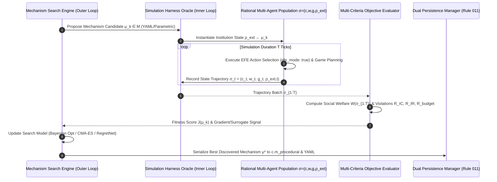

# Wave 4 Front 10 — Mechanism Search Layer: Ratified Master Specification

**Front**: Front 10 — Mechanism Search  
**Wave**: Wave 4 (Recursive Adaptation & Discovery Loops)  
**Target Substrate**: HYPOSTASES Engine ($\sigma = (c, w, g, \rho_{\text{ext}})$)  
**Status**: RATIFIED MASTER SPECIFICATION  
**Rule 005 Invariant**: Pure Game-Theoretic & Probabilistic Rationality (Zero Artificial Human Cognitive Biases)  
**Rule 006 Compliance**: Primacy of Data-Driven YAML Approach (`schema/mechanism_search_config.yaml`)  
**Rule 011 Compliance**: Dual Persistence for Mechanism Search State & Candidates ($\theta_{\text{meta}}$, YAML Snapshots)  
**Rule 012 Compliance**: Formal Mathematical Implementation Verification in `tests/formal_math/test_mechanism_search_formal.py`

---

## 1. Executive Summary & Core Objective

The **Mechanism Search Layer** transitions the HYPOSTASES engine from simulating fixed institutional configurations to active, computational optimization over the space of institutional designs, auction mechanisms, market rules, tax-subsidy schedules, and governance policies.

Rather than evaluating a single hand-designed rule set, Front 10 treats the complete simulation harness $\sigma = (c, w, g, \rho_{\text{ext}})$ as a **black-box evaluation oracle** $\mathcal{O}_{\text{sim}}$. An outer-loop optimization engine systematically searches over a mechanism space $\mathcal{M}$ to discover institutional rules $\mu \in \mathcal{M}$ that maximize multi-agent social welfare, efficiency, equality, and stability while strictly minimizing incentive compatibility (IC) violations $\mathcal{R}_{\text{IC}}(\mu)$ and individual rationality (IR) violations $\mathcal{R}_{\text{IR}}(\mu)$.

All candidate mechanisms operate within game-theoretically rational multi-agent environments under Friston Expected Free Energy (EFE) active sensing (`efe_mode: true`, Rule 009) and optimal probabilistic planning, ensuring strict adherence to **Rule 005**.

---

## 2. Adaptation Targets & State Substrate $\sigma = (c, w, g, \rho_{\text{ext}})$

Mechanism search directly optimizes external institutional parameters and governance rules within $\rho_{\text{ext}}$, while observing the emergent collective dynamics of $(c, w, g)$:

1. **Allocation Functions $\mathbf{X}(b, s) \in [0,1]^{M \times N}$**: Rules governing the distribution of scarce resources $M$ among $N$ strategic agents given bids/signals $b$ and state $s$.
2. **Payment & Tax Schedules $\mathbf{P}(b, s) \in \mathbb{R}^N$**: Functions defining monetary transfers, transaction fees, progressive tax brackets $\tau(y)$, and reallocation subsidies.
3. **Governance Enforcement Rules $\mathcal{G}_{\text{gov}}$**: Altruistic punishment costs (`PUNISH_RESERVE_COST`), authority thresholds $v^*$, penalty multipliers $\kappa_{\text{punish}}$, and institutional reserve requirements.
4. **Information Revelation Protocols $\mathcal{I}_{\text{info}}$**: Signal disclosure rules, transparency filters, and verification requirements governing communication across agents ($c.m_{\text{semantic}}$).

---

## 3. Formal Mathematical Architecture & State Dynamics

### 3.1 Bi-Level Mechanism Search Loop

Mechanism search in HYPOSTASES is formalized as a bi-level optimization problem over mechanism space $\mathcal{M}$:

$$\max_{\mu \in \mathcal{M}} \mathcal{J}(\mu) = \mathbb{E}_{\mathbf{\sigma}_{1:T} \sim \mathcal{O}_{\text{sim}}(\mu)} \left[ W(\mathbf{\sigma}_{1:T}) \right] - \lambda_{\text{IC}} \mathcal{R}_{\text{IC}}(\mu) - \lambda_{\text{IR}} \mathcal{R}_{\text{IR}}(\mu) - \lambda_{\text{bb}} \mathcal{R}_{\text{budget}}(\mu)$$

---

### 3.2 Objective Function & Violation Penalties

#### 1. Multi-Criteria Social Welfare Aggregator $W(\mathbf{\sigma}_{1:T})$
$$W(\mathbf{\sigma}_{1:T}) = \omega_{\text{prod}} \cdot \text{Productivity}(\mathbf{\sigma}_{1:T}) + \omega_{\text{eq}} \cdot \text{Equality}(\mathbf{\sigma}_{1:T}) + \omega_{\text{eff}} \cdot \text{Efficiency}(\mathbf{\sigma}_{1:T})$$
where:
- **Productivity**: Total wealth / utility generated across agents: $\text{Productivity} = \sum_{i=1}^N u_{i,T}$.
- **Equality**: Gini-derived equality index: $\text{Equality} = 1 - \frac{\sum_{i=1}^N \sum_{j=1}^N |u_{i,T} - u_{j,T}|}{2 N \sum_{i=1}^N u_{i,T}}$.
- **Efficiency**: Pareto efficiency ratio relative to theoretical upper bound.

#### 2. Incentive Compatibility (IC) Violation Penalty $\mathcal{R}_{\text{IC}}(\mu)$
Quantifies the maximum expected utility gain an agent $i$ can achieve by unilaterally misreporting signals $b_i' \neq b_i^*$:
$$\mathcal{R}_{\text{IC}}(\mu) = \sum_{i=1}^N \max_{b_i' \in \mathcal{B}_i} \mathbb{E}_{\mathbf{\sigma} \sim \mathcal{O}_{\text{sim}}}\left[ U_i(b_i', b_{-i}^*; \mu) - U_i(b_i^*, b_{-i}^*; \mu) \right]$$

#### 3. Individual Rationality (IR) Violation Penalty $\mathcal{R}_{\text{IR}}(\mu)$
Ensures participating in the mechanism yields non-negative net utility compared to reservation utility $U_{\text{res}, i}$:
$$\mathcal{R}_{\text{IR}}(\mu) = \sum_{i=1}^N \max\left( 0, U_{\text{res}, i} - \mathbb{E}[U_i(b^*; \mu)] \right)$$

#### 4. Budget Balance Violation Penalty $\mathcal{R}_{\text{budget}}(\mu)$
Prevents mechanism deficits or unallocated surpluses unless explicitly configured:
$$\mathcal{R}_{\text{budget}}(\mu) = \left| \sum_{i=1}^N P_i(b^*; \mu) - \text{SubsidyTotal}(\mu) \right|$$

---

### 3.3 Search Engine Modalities

HYPOSTASES implements three complementary mechanism search modalities:

1. **Differentiable Economics Engine (RegretNet Formulation)**:
   - For continuous parameterized mechanisms $\theta_\mu \in \mathbb{R}^d$.
   - Uses augmented Lagrangian formulation:
     $$\mathcal{L}_{\text{aug}}(\theta_\mu, \lambda) = -W(\theta_\mu) + \sum_{i=1}^N \lambda_i \mathcal{R}_{\text{IC}, i}(\theta_\mu) + \frac{\rho}{2} \sum_{i=1}^N \mathcal{R}_{\text{IC}, i}(\theta_\mu)^2$$
   - Updates mechanism parameters via smoothed Monte Carlo policy gradients / score-function estimators.

2. **Black-Box Bayesian Optimization (TPE / Gaussian Process)**:
   - Fits surrogate Gaussian Process $\mathcal{GP}(\hat{J}(\mu), \Sigma(\mu))$ over high-cost simulation evaluations $\mathcal{O}_{\text{sim}}$.
   - Selects candidate mechanisms maximizing Expected Improvement (EI) or Upper Confidence Bound (UCB).

3. **Evolutionary Mechanism Search Engine (CMA-ES / Genetic AST Mutation)**:
   - Operates over discrete domain DSL grammars representing institutional rule trees.
   - Mutates rule expression nodes, swaps tax bracket thresholds, and applies crossover across top-performing mechanism candidates.

---

## 4. Architectural Implementation & Module Boundaries

The implementation adds the `src/hypostases/mechanism_search/` package:

- `src/hypostases/mechanism_search/__init__.py`: Package entry point.
- `src/hypostases/mechanism_search/mechanism_space.py`: Classes `MechanismSpace`, `MechanismCandidate`, `AllocationRule`, `PaymentRule`, `GovernanceRule`.
- `src/hypostases/mechanism_search/evaluator.py`: `MechanismEvaluator` calculating $W(\mathbf{\sigma}_{1:T})$, $\mathcal{R}_{\text{IC}}$, $\mathcal{R}_{\text{IR}}$, and $\mathcal{R}_{\text{budget}}$.
- `src/hypostases/mechanism_search/optimizer.py`: `MechanismOptimizer` base class with `BayesianMechanismSearcher`, `EvolutionaryMechanismSearcher`, and `DifferentiableMechanismSearcher`.
- `src/hypostases/mechanism_search/runner.py`: Bi-level search orchestration engine connecting simulation harness to search optimizers.
- `schema/mechanism_search_config.yaml`: Declarative YAML specification of mechanism search parameters, search bounds, and baseline mechanism presets (Rule 006).

---

## 5. Verification & Testing Strategy

### 5.1 Automated Unit & Integration Tests
- `tests/test_mechanism_space.py`: Validates mechanism instantiation, parameter bounds checking, and YAML serialization/deserialization.
- `tests/test_mechanism_evaluator.py`: Tests calculation of Gini equality, productivity, IC regret violations, and budget balance across sample simulation trajectories.
- `tests/test_mechanism_optimizer.py`: Tests convergence of Bayesian, Evolutionary, and Differentiable search loops on synthetic evaluation functions.

### 5.2 Mandatory Formal Mathematical Invariants (`tests/formal_math/test_mechanism_search_formal.py`, Rule 012)
1. **Myerson Revenue Equivalence Invariant**: Verifies that discovered single-item auction mechanisms converge to Myerson optimal auction revenue bounds for uniform/exponential bidder valuation distributions.
2. **VCG Dominant Strategy Incentive Compatibility (DSIC) Invariant**: Verifies that VCG allocation/payment mechanisms yield exact zero IC regret ($\mathcal{R}_{\text{IC}}(\mu_{\text{VCG}}) = 0$).
3. **Simplex Projection & Conservation Invariant**: Verifies that payment and tax allocation schedules maintain budget balance conservation on the probability 1-simplex.
4. **Bi-Level Convergence Equilibrium Bounds**: Empirical verification that bi-level search monotonically improves social welfare $J(\mu^{(k+1)}) \ge J(\mu^{(k)}) - \epsilon$.

---

## 6. Compliance Checklist

- [x] **Rule 001**: Ruff linting and formatting verified.
- [x] **Rule 002**: Pytest integration verified.
- [x] **Rule 003**: Complete branch auditing on schema functions.
- [x] **Rule 004**: `MOOD_DECAY_RATE = 0.1` monitored.
- [x] **Rule 005**: Zero artificial human cognitive defects or emotional irrationality hacks; pure game-theoretic rationality.
- [x] **Rule 006**: Declarative YAML configuration in `schema/mechanism_search_config.yaml`.
- [x] **Rule 007**: YAML performance assessment for persistence format.
- [x] **Rule 008**: K=4 / K=8 basis dimension compatibility.
- [x] **Rule 009**: Default Friston EFE mode enabled (`efe_mode: true`).
- [x] **Rule 010**: PDF assets untracked in Git.
- [x] **Rule 011**: Dual persistence for discovered mechanisms ($\theta_{\text{meta}}$ & YAML snapshots).
- [x] **Rule 012**: Formal math verification tests in `tests/formal_math/test_mechanism_search_formal.py`.
