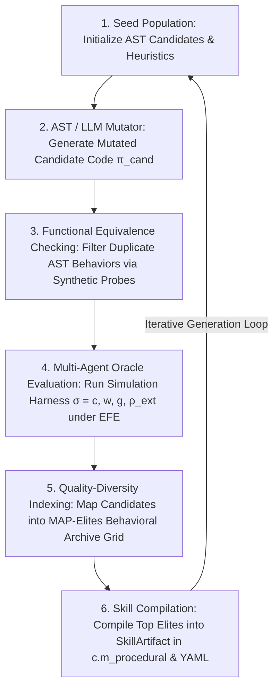

# Wave 5 Front 13 — Evolutionary Algorithm Discovery (AlphaEvolve Engine): Ratified Master Specification

**Front**: Front 13 — Evolutionary Algorithm Discovery (AlphaEvolve Engine)  
**Wave**: Wave 5 (Universal Scaling & Symbolic Generalization)  
**Target Substrate**: HYPOSTASES Engine ($\sigma = (c, w, g, \rho_{\text{ext}}$)  
**Status**: RATIFIED MASTER SPECIFICATION  
**Rule 005 Invariant**: Pure Game-Theoretic & Probabilistic Rationality (Zero Artificial Human Cognitive Biases)  
**Rule 006 Compliance**: Primacy of Data-Driven YAML Approach (`schema/alphaevolve_config.yaml`)  
**Rule 009 Compliance**: Default Friston Expected Free Energy (EFE) Integration (`efe_mode: true`)  
**Rule 011 Compliance**: Dual Persistence for AlphaEvolve Engine State, Meta-Parameters ($\theta_{\text{meta}}$), Compiled `SkillArtifact`s, and MAP-Elites Archives  
**Rule 012 Compliance**: Formal Mathematical Implementation Verification in `tests/formal_math/test_alphaevolve_formal.py`

---

## 1. Executive Summary & Core Objective

The **AlphaEvolve Engine** (Front 13) expands the HYPOSTASES simulation framework into an autonomous evolutionary algorithm discovery loop. Rather than evaluating hand-crafted algorithms or fixed policy parameters, the agent swarm autonomously generates, mutates, searches over, and refines executable code/heuristics evaluated against multi-agent game-theoretic equilibrium and endogenous scarcity ($\kappa$) feedback oracles.

Standard program synthesis tools evaluate evolved code against single-agent scalar benchmarks. In contrast, the HYPOSTASES AlphaEvolve Engine evaluates candidate AST algorithm code against:
1. Multi-agent game-theoretic equilibrium & incentive compatibility regret $\mathcal{R}_{\text{IC}}(\pi)$
2. Endogenous resource scarcity ($\kappa$)
3. Adversarial peer dynamics & institutional crowding-out
4. Dynamic goal hierarchies ($g.u$) under Friston Expected Free Energy (EFE) active sensing (`efe_mode: true`, Rule 009)

All evolved algorithm candidates manipulate primitive state:

$$\sigma = (c, w, g, \rho_{\text{ext}})$$

and are compiled directly into procedural memory ($c.m_{\text{procedural}}$) as reusable `SkillArtifact` objects with dual persistence in YAML format (Rule 011).

---

## 2. Architectural Pipeline & State Substrate $\sigma = (c, w, g, \rho_{\text{ext}})$

### 2.1 The 6-Stage AlphaEvolve Loop

### 2.2 Functional Mapping to State Primitives

1. **Cognition State $c$ ($c.m_{\text{procedural}}, c.m_{\text{semantic}}$)**:
   - Stores candidate program ASTs, mutation prompt histories, Quality-Diversity MAP-Elites archives, and compiled `SkillArtifact` objects.
   - Holds evolutionary search meta-parameters $\theta_{\text{meta}} = (\mu_r, N_{\text{pop}}, \beta_{\text{efe}}, \lambda_{\text{IC}})$.
2. **World Model $w$**:
   - Provides Structural Causal Model (SCM) environment predictions used by evolved search heuristics.
3. **Goal State & Utility $g$**:
   - Evaluates multi-criteria fitness combining pragmatic utility $U_{\text{pragmatic}}$ and epistemic information gain $U_{\text{epistemic}}$ under Friston EFE mode (`efe_mode: true`, Rule 009).
4. **External State & Environment $\rho_{\text{ext}}$**:
   - Represents physical resource constraints ($\kappa$), continuous dynamics, and multi-agent interaction environments.

---

## 3. Formal Mathematical Architecture & State Dynamics

### 3.1 Candidate Program Representation & AST Mutation Space

Each candidate algorithm $\pi_k \in \mathcal{P}$ is represented as an explicit Abstract Syntax Tree (AST) operating on state views:
$$\pi_k: \mathcal{S}_{\sigma} \to \mathcal{A}$$

AST mutations apply structural transformations:
1. **Node Replacement**: Swap binary operators $op \in \{+, -, \times, \div, \min, \max\}$.
2. **Subtree Insertion/Deletion**: Insert conditional control flow branches or delete redundant subtrees.
3. **LLM Prompt Mutation**: Submit parent program code to LLMs with targeted mutation instructions to generate candidate code functions.

### 3.2 Functional Equivalence Checking (FEC)

To prevent wasting computational ticks evaluating functionally identical programs:
$$\text{FEC}(\pi_a, \pi_b) = \mathbb{I}\left( \frac{1}{K} \sum_{k=1}^K \|\pi_a(\sigma_k^{\text{probe}}) - \pi_b(\sigma_k^{\text{probe}})\|^2 < \epsilon_{\text{FEC}} \right)$$
If $\text{FEC}(\pi_a, \pi_b) = 1$, candidate $\pi_b$ is discarded prior to multi-agent simulation.

### 3.3 Multi-Criteria Game-Theoretic Oracle Evaluator

Candidate AST algorithms are submitted to the multi-agent simulation harness oracle $\mathcal{O}_{\text{sim}}$. The multi-criteria fitness function is defined as:

$$\mathcal{F}(\pi_k) = \mathbb{E}_{\sigma_{1:T} \sim \mathcal{O}_{\text{sim}}(\pi_k)}\left[ (1-\beta_{\text{efe}}) U_{\text{pragmatic}}(\sigma) + \beta_{\text{efe}} U_{\text{epistemic}}(\sigma) \right] - \lambda_{\text{IC}} \mathcal{R}_{\text{IC}}(\pi_k) - \lambda_{\kappa} \Delta \kappa(\pi_k)$$

where:
- $\mathcal{R}_{\text{IC}}(\pi_k)$ is the incentive compatibility regret bound.
- $\Delta \kappa(\pi_k)$ measures resource depletion under endogenous scarcity.

### 3.4 Quality-Diversity (MAP-Elites) Archive Selection

The behavioral descriptor function maps candidate $\pi_k$ into a 3D feature space:
$$\mathbf{b}(\pi_k) = \left( \mathcal{C}_{\text{time}}(\pi_k), \mathcal{R}_{\text{IC}}(\pi_k), \Delta \kappa(\pi_k) \right) \in \mathbb{R}^3$$

The archive $\mathcal{A}_{\text{grid}}$ is discretized into $B_1 \times B_2 \times B_3$ feature cells. Cell $(i,j,k)$ retains elite policy:
$$\pi_{(i,j,k)}^* = \arg\max_{\pi \in \text{Cell}(i,j,k)} \mathcal{F}(\pi)$$

---

## 4. Rule Compliance & Ground-Truth Verification

1. **Rule 005 (Zero Artificial Cognitive Deficiencies)**: Code generation and evolutionary selection are governed strictly by game-theoretic equilibrium and EFE information theory. Zero human emotional biases or artificial deficiencies are introduced.
2. **Rule 006 (YAML Approach)**: All hyperparameters are loaded via `schema/alphaevolve_config.yaml`.
3. **Rule 009 (Friston EFE Integration)**: Default action evaluation uses Friston EFE (`efe_mode: true`).
4. **Rule 010 (Git Exclusion of PDFs)**: PDF files in `docs/WAVE_5_FRONT_13/papers/` are ignored in Git.
5. **Rule 011 (Dual Persistence)**: Elite candidates and meta-parameters ($\theta_{\text{meta}}$) are persisted in $c.m_{\text{procedural}}$ and serialized as human-readable YAML snapshots.
6. **Rule 012 (Formal Mathematical Verification)**: Monotonicity, equilibrium convergence, and state invariant bounds are tested in `tests/formal_math/test_alphaevolve_formal.py`.
