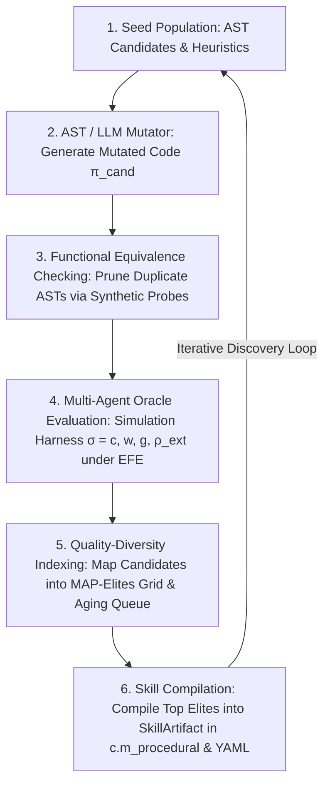

# Front 13 — Evolutionary Algorithm Discovery (AlphaEvolve Engine)

**Status**: `RATIFIED & IMPLEMENTED`  
**Ratified Master Specification**: [`docs/WAVE_5_FRONT_13/front_13_evolutionary_algorithm_discovery_alphaevolve_spec.md`](../WAVE_5_FRONT_13/front_13_evolutionary_algorithm_discovery_alphaevolve_spec.md)  
**Literature & Papers Manifest**: [`docs/WAVE_5_FRONT_13/papers_manifest.md`](../WAVE_5_FRONT_13/papers_manifest.md)  
**Synthesized Pertinent Literature**: [`docs/WAVE_5_FRONT_13/pertinent_literature.md`](../WAVE_5_FRONT_13/pertinent_literature.md)  
**Declarative YAML Configuration**: [`schema/alphaevolve_config.yaml`](../../schema/alphaevolve_config.yaml)  
**Formal Math Verification**: [`tests/formal_math/test_alphaevolve_formal.py`](../../tests/formal_math/test_alphaevolve_formal.py)

---

## Overview

The **AlphaEvolve Engine** (Front 13) expands HYPOSTASES into an autonomous evolutionary algorithm discovery loop. Instead of evaluating static code or hand-crafted heuristics, agent swarms autonomously generate, mutate, search over, and refine executable AST Python algorithms evaluated against multi-agent game-theoretic equilibrium and endogenous scarcity ($\kappa$) feedback oracles.

---

## The 6-Stage AlphaEvolve Architecture

---

## Synthesized SOTA Paradigms

1. **LLM Program Search & AST Mutation (AlphaEvolve / FunSearch)**:
   - Evaluates multi-component AST programs across island demes $\mathcal{I} = \{I_1, \dots, I_m\}$ with signature clustering $\mathbf{s}(x)$ and Boltzmann cluster selection $P(C_i) \propto \exp(s_i / T_{\text{cluster}})$ (Novikov et al. 2025, Romera-Paredes et al. 2023).
   - Enforces length-weighted parsimony sampling $P_{\text{prog}}(x) \propto \exp(\tilde{\ell}(x) / T_{\text{program}})$ (Solomonoff Induction / MDL).
2. **Quality-Diversity (MAP-Elites) Archives**:
   - Maintains an $N$-dimensional elite archive grid discretized over $(\mathcal{C}_{\text{time}}, \mathcal{R}_{\text{IC}}, \Delta \kappa_{\text{scarcity}})$ to prevent premature convergence (Mouret & Clune 2015).
3. **Behavioral Novelty Search**:
   - Computes $k$-nearest neighbor novelty distance $\rho(x, \mathbf{S}) = \frac{1}{k} \sum_{i=1}^k \|\beta(x) - \mu_i\|_2$ to navigate deceptive search landscapes (Lehman & Stanley 2011).
4. **Morphological Reservoir Co-Evolution**:
   - Co-evolves physical body dynamics $x(t+1) = f_{\text{body}}(x(t), u(t); \theta_{\text{body}}) \in \rho_{\text{ext}}$ with software linear readout controllers $u(t) = W_{\text{out}} \Phi(x(t)) \in w$, maximizing morphological computation index $MC_1 = I(W'; W \mid A)$ (Müller & Hoffmann 2017).
5. **Regularized Aging Evolution & Functional Equivalence Checking (FEC)**:
   - Discards the oldest candidate in a FIFO queue of size $N_{\text{pop}}$ to enforce strict lifespan regularization against stochastic evaluation noise (Real et al. 2019).
   - Collapses redundant AST mutations using synthetic probe state evaluation $\text{FEC}(\pi_a, \pi_b)$ (Real et al. 2020).

---

## Core State Constraint

All evolved algorithm candidates manipulate primitive state:

$$\sigma = (c, w, g, \rho_{\text{ext}})$$

and are stored as compiled `SkillArtifact` objects within procedural memory ($c.m_{\text{procedural}}$) with dual persistence in YAML format (Rule 011).
